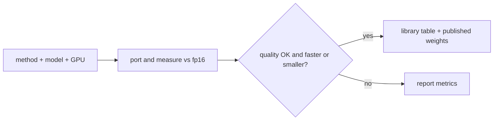

# quant-agent

This repo is a **set of skills**. You run **your own AI agent** (Cursor,
Claude Code, Codex, or similar) **on a GPU instance** and use the skills
in [`agents/skills/`](agents/skills/). There is no separate program to
launch — the agent reads [`agents/AGENTS.md`](agents/AGENTS.md), then
follows `quant`. For the full skill list and workflow, see
[`agents/README.md`](agents/README.md).

Those skills port any quantization **method** onto any **model** on that
GPU: find the paper and code, adapt the method, run **one** job, check
that the **saved** weights still generate, and always measure WikiText-2
against the original fp16 checkpoint (perplexity, tokens/s, VRAM).

You provide three things:

- **method** — e.g. SmoothQuant, AWQ, FlatQuant
- **model** — any checkpoint gather can snapshot (usually `org/name`; not
  limited to Microsoft Phi or Hugging Face’s own models)
- **GPU instance** — e.g. `g5.2xlarge`

```text
port SmoothQuant to ibm-granite/granite-3.3-2b-instruct on g5.2xlarge
port AWQ to org/my-instruct on g6e.xlarge
```



Open this repo in your agent on the GPU box and invoke `quant`. It collects
the three inputs, runs the stages, retries only when diagnose says so, and
never commits checkpoints.

## Library

Successful runs are ranked here. A run is published when WikiText-2 stays
within 1.5× fp16 perplexity **and** VRAM or speed beats fp16. The table
compares methods on the same model × GPU. Rows already in the table
(Granite, Phi-3, …) are **published examples**, not the set of allowed
models.

Hugging Face is where **weights** are stored and downloaded, not which
models you may quantize.

- **Ranking (GitHub):** [library/LIBRARY.md](library/LIBRARY.md)
- **Weights:** [quant-agent collection](https://huggingface.co/collections/chris320211/quant-agent-library-6aaf22fcafd69b39eabc9230)

## Setup

Use a **disposable** NVIDIA GPU host (driver + CUDA 12.x, Python ≥ 3.10,
git). The agent runs third-party method code on this machine. Size hints,
not a whitelist: `g5.xlarge` (≤13B), `g6e.xlarge` (≤34B), `g5.12xlarge`
(≤70B).

```bash
git clone https://github.com/chris320211/model-quantization-agent.git
cd model-quantization-agent
PY=$(command -v python || command -v python3)
"$PY" -m pip install -c constraints.txt -e '.[dev]'
cp .env.example .env
chmod 600 .env
# edit .env in your editor: HF_TOKEN=...  (optional GITHUB_TOKEN=)
source agents/skills/_shared/load_env.sh .env
```

Create `.env` **once**. Every new terminal, only `source` the loader. Never
paste token values into chat. `.env` is gitignored. `HF_TOKEN` is the Hub
token for gated downloads and for publishing quantized weights.

## Outputs

| Path | What |
| --- | --- |
| `quantized/<slug>` | Saved quantized weights |
| `jobs/<id>/benchmark.json` | WikiText-2 vs fp16 |
| `library/LIBRARY.md` | Ranking of published runs |

```bash
PY=$(command -v python || command -v python3)
"$PY" agents/skills/_shared/scripts/jobs.py list
"$PY" agents/skills/_shared/scripts/jobs.py status <job_id>
"$PY" agents/skills/_shared/scripts/jobs.py logs <job_id> -n 200
```

## Documentation

This README is the short overview. Details live under [`agents/`](agents/):

| Doc | What it covers |
| --- | --- |
| [`agents/README.md`](agents/README.md) | Skill list, stage workflow, what each skill does |
| [`agents/AGENTS.md`](agents/AGENTS.md) | How the agent should start; secret rules |
| [`agents/skills/quant/SKILL.md`](agents/skills/quant/SKILL.md) | Parent skill — invoke this one |
| [`agents/skills/_shared/pipeline_contract.md`](agents/skills/_shared/pipeline_contract.md) | Order, retries, on-disk layout |
| [`agents/skills/_shared/subagents.md`](agents/skills/_shared/subagents.md) | How stages are launched |
| [`library/LIBRARY.md`](library/LIBRARY.md) | Published ranking table |
| [`library/contributions/README.md`](library/contributions/README.md) | How to add a library row |

Every skill is a `SKILL.md` in [`agents/skills/`](agents/skills/).
