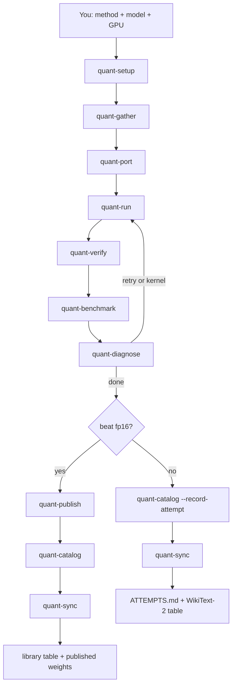

# Skills

This folder is the skill tree your AI agent follows on a GPU host. You do
not start a separate quant-agent process — open this repo in Cursor, Claude
Code, Codex, or similar, and invoke `quant`.

The parent skill collects **method**, **model**, and **GPU instance**, then
launches one stage at a time. Same loop for every method × model × GPU —
not a Phi-3 or Hub-family special case.

Human overview: [`README.md`](../README.md).
Agent entry: [`AGENTS.md`](AGENTS.md).
Contract: [`skills/_shared/pipeline_contract.md`](skills/_shared/pipeline_contract.md).

`PY=$([ -x .venv/bin/python ] && echo .venv/bin/python || command -v python || command -v python3)`
`S="$PY agents/skills/_shared/scripts"`

## Parent (this session)

| Skill | Does |
| --- | --- |
| [quant](skills/quant/SKILL.md) | Dispatcher. Same loop for every method × model × GPU. |
| [quant-setup](skills/quant-setup/SKILL.md) | Ask the user for a mode-600 `.env` once per machine; load it every shell. Never read the file. |
| [quant-publish](skills/quant-publish/SKILL.md) | Upload saved weights + WikiText-2 metrics to the Hub. |
| [quant-catalog](skills/quant-catalog/SKILL.md) | Record a published library row, or an unsuccessful attempt. |
| [quant-sync](skills/quant-sync/SKILL.md) | Push `library/` to GitHub and refresh the Hub collection. Never commits checkpoints. |

## Subagents (one stage each)

| Skill | Does |
| --- | --- |
| [quant-gather](skills/quant-gather/SKILL.md) | Find paper + GitHub, clone, snapshot the named model, record GPU facts, install one venv. Writes `out/requests/<slug>.json`. |
| [quant-port](skills/quant-port/SKILL.md) | Try up to three port strategies. Validate only. Return a ranked winner overlay. |
| [quant-run](skills/quant-run/SKILL.md) | Launch the winner script on this GPU. One job at a time. No inner overlay patches. |
| [quant-verify](skills/quant-verify/SKILL.md) | Reload the **saved** artifact (not the original fp16) and require generation. |
| [quant-benchmark](skills/quant-benchmark/SKILL.md) | Always WikiText-2 vs the fp16 snapshot: PPL, tok/s, VRAM. Does not write the library. |
| [quant-diagnose](skills/quant-diagnose/SKILL.md) | Classify after a failed run, failed verify, or passed benchmark (including success). A crashed GPU job is not `none`. Does not write overlays. |
| [quant-kernel](skills/quant-kernel/SKILL.md) | Packed / prefill kernels only when diagnose says `kernel`. |

## After a good run

A run is **beneficial** when `quality_ok` (PPL ≤ 1.5× fp16) and VRAM **or**
tok/s beat fp16. Then, in the parent:

1. `quant-publish` — quantized weights on the Hub
2. `quant-catalog` — row in [`library/LIBRARY.md`](../library/LIBRARY.md)
3. `quant-sync` — GitHub table + [weight collection](https://huggingface.co/collections/chris320211/quant-agent-library-6aaf22fcafd69b39eabc9230)

Without push access, PR `library/contributions/<model>__<gpu>__<method>.json`.
See [`library/contributions/README.md`](../library/contributions/README.md).

## After an unsuccessful stop

If diagnose is `none` and the run is not beneficial, still record it:

1. `quant-catalog` `--record-attempt` — row in [`library/ATTEMPTS.md`](../library/ATTEMPTS.md)
2. `quant-sync` — GitHub only (no Hub weights, collection stays `quality_ok`)
